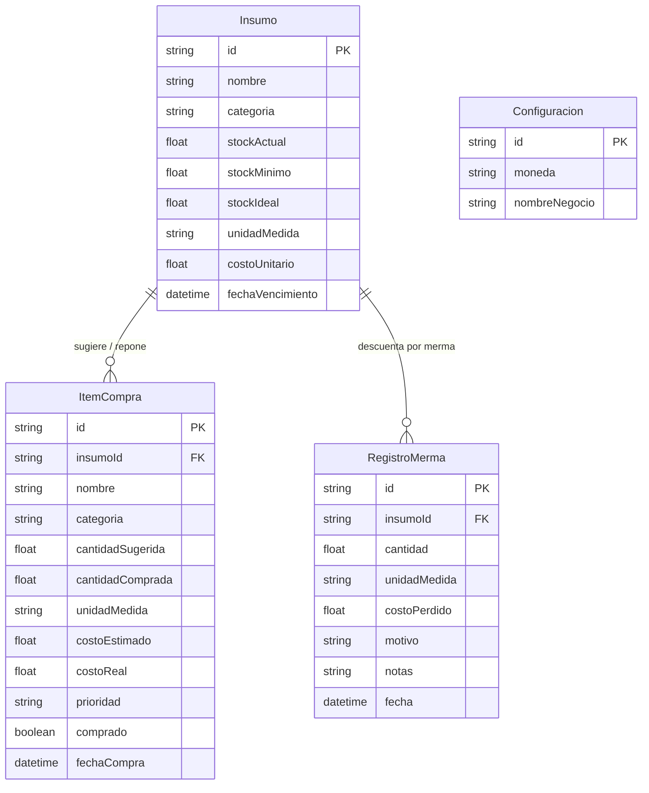

# 🍳 GastroStock Pro - PWA Gastronómica

Aplicación Web Progresiva (PWA) de alto rendimiento y ergonomía táctil, diseñada específicamente para operarse con una sola mano en entornos exigentes de **cocina, despensa y compras de abasto**.

---

## ⚡ Características Principales

- **🖐️ Ergonomía Single-Hand (Mobile First):**
  - Barra de navegación inferior fija (`BottomNav`) accesible con el pulgar.
  - Zonas de toque amplias ($\ge 48\text{px}$) y botones `+` / `-` de alta respuesta.
  - Modo oscuro de alto contraste por defecto (`bg-neutral-950`), ideal para entornos con vapor, grasa o cambios bruscos de luz.
- **📦 Control de Inventario y Stock (`/inventory`):**
  - Categorías gastronómicas: *Carnes, Verduras, Secos, Lácteos, Bebidas, Descartables*.
  - Semáforos automáticos: **Óptimo** (verde), **Bajo Stock** (amarillo cuando $\le$ stock mínimo), **Agotado** (rojo) y **Por Vencer** (alerta en $\le 3$ días).
  - Botón táctil directo de **"Merma / Desperdicio"**: descuenta stock al instante y registra motivo (*Vencido, Roto, Mal Estado, Otro*).
- **🛒 Lista de Compras Inteligente (`/shopping-list`):**
  - **Sugerencia automática de faltantes:** Con un solo toque analiza todos los insumos agotados o en bajo stock y calcula la cantidad ideal de reposición.
  - **Carga manual puntual** con prioridad (*Alta, Media, Baja*).
  - **Check de compra dinámico:** Al tildar un producto, permite confirmar la cantidad real adquirida y el costo unitario pagado, **ingresando de forma automática el stock al inventario**.
- **💰 Costos, Presupuesto y Mermas (`/costs`):**
  - **Presupuesto proyectado antes de salir de compras:** $\sum (\text{cantidad} \times \text{costo estimado})$.
  - **Valorización de inventario inmovilizado:** $\sum (\text{stock actual} \times \text{costo unitario})$.
  - **Control de pérdidas por merma:** Desglose del dinero descartado en el mes con porcentajes por motivo y detalle temporal.
  - Moneda configurable (`$`, `USD`, `EUR`, etc.).
- **📊 Dashboard Principal (`/`):**
  - KPIs en vivo, buscador instantáneo, insumos críticos y accesos directos de reposición.
- **📶 PWA & Offline:**
  - Manifiesto PWA (`manifest.json`), service worker (`sw.js`) e indicador en tiempo real de conexión Online/Offline.

---

## 🏗️ Stack Tecnológico

- **Frontend:** Next.js 14 (App Router), TypeScript, Tailwind CSS, Lucide React Icons.
- **Backend / ORM:** Next.js Route Handlers + Prisma ORM.
- **Base de Datos:** SQLite local autónomo (`prisma/dev.db`). No requiere Docker ni bases de datos externas en la nube.

---

## 🗄️ Esquema de Base de Datos (Prisma)



---

## 🚀 Guía de Puesta en Marcha Local

### 1. Requisitos Previos
Asegúrate de contar con Node.js (versión 18 o superior). Si estás en Windows y aún no lo tienes instalado, puedes instalarlo rápidamente ejecutando en PowerShell:
```powershell
winget install OpenJS.NodeJS.LTS
```

### 2. Instalación de Dependencias
En la carpeta del proyecto (`proyectos/web/gastro-stock-pwa`):
```bash
npm install
```

### 3. Inicializar la Base de Datos SQLite y Datos de Prueba
Ejecuta el script de configuración que crea la base de datos local y carga datos realistas de restaurante:
```bash
npm run setup
```

### 4. Iniciar el Servidor de Desarrollo
```bash
npm run dev
```

Abre [http://localhost:3000](http://localhost:3000) en tu navegador (o desde tu celular en la misma red Wi-Fi `http://<IP-LOCAL>:3000`) para experimentar la interfaz táctil.

---

## 📱 Instalación en Dispositivos Móviles (PWA)
1. Abre la aplicación desde Chrome (Android) o Safari (iOS).
2. Toca en **"Agregar a pantalla de inicio"** / **"Instalar aplicación"**.
3. La aplicación se abrirá en modo de pantalla completa nativa sin barras de navegación del explorador.

---

## 🔗 Relación con el Workspace MÖLDEA
- [AGENTS.md](../../../AGENTS.md)
- [proyectos/web/README.md](../README.md)
- [docs/GUIA_DOCUMENTACION.md](../../../docs/GUIA_DOCUMENTACION.md)

